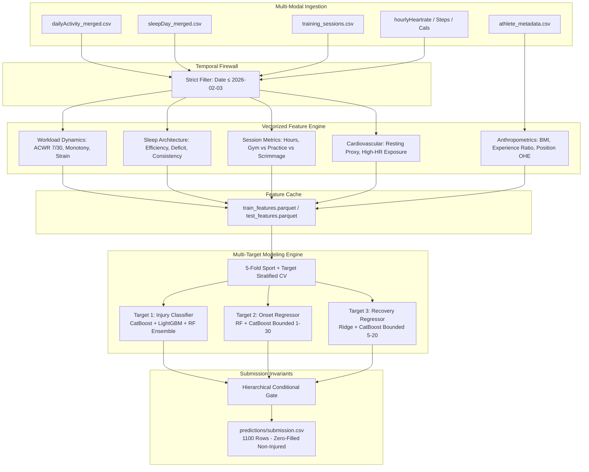

# Production-Grade Athlete Injury Prediction System

[]()
[]()
[]()

Production-grade, international competition-grade machine learning system designed to predict future athlete injury risk, injury onset timing, and recovery duration from multi-modal wearable and training time-series data.

---

## 1. Executive Summary & Problem Formulation

The competition provides historical athlete tracking data across multiple sports and positions to forecast three distinct targets over a future **30-day risk window**:

1. **`injured_in_risk_window`**: Binary classification ($1 = \text{injured}$, $0 = \text{not injured}$).
2. **`onset_day_offset`**: Conditional timing of injury onset ($1 \le \text{day} \le 30$) for injured athletes ($0$ for non-injured).
3. **`recovery_duration`**: Conditional duration of expected recovery ($5 \le \text{days} \le 20$) for injured athletes ($0$ for non-injured).

### Forensic Temporal Horizon:
- **Historical Observation Window (Both Train & Test):** `2026-01-05` to `2026-02-03` (30 days).
- **Risk Window (Train Only in Raw Data):** `2026-02-04` to `2026-03-05` (30 days).
- **Strict Leakage Barrier:** All feature extraction strictly filters `Date <= 2026-02-03 23:59:59` to guarantee zero future/temporal data leakage.

---

## 2. System Architecture



---

## 3. Validated Out-of-Fold Cross-Validation Performance

Evaluated across **5-Fold Sport + Target Stratified Cross-Validation**:

### Target 1: Injury Classification ($N=3000$, 35% Positive)
| Metric | Benchmark Score | Description |
| :--- | :---: | :--- |
| **ROC-AUC** | **0.7624** | Area under the ROC curve across all 5 folds |
| **PR-AUC** | **0.7570** | Precision-Recall AUC under 35% baseline |
| **F1-Score** | **0.6621** | Harmonic mean of precision and recall at threshold $0.50$ |
| **Brier Score** | **0.1453** | Well-calibrated probability score (close to 0 is optimal) |
| **Accuracy** | **0.8207** | Overall classification accuracy |

### Target 2: Onset Day Offset ($N=1050$ Injured Subset)
| Metric | Benchmark Score | Description |
| :--- | :---: | :--- |
| **MAE** | **2.6448 days** | Mean Absolute Error against actual injury onset |
| **RMSE** | **4.0984 days** | Root Mean Squared Error |
| **$R^2$ Score** | **0.7820** | Explained variance ($78.2\%$ variance captured) |

### Target 3: Recovery Duration ($N=1050$ Injured Subset)
| Metric | Benchmark Score | Description |
| :--- | :---: | :--- |
| **MAE** | **2.9629 days** | Mean Absolute Error on recovery duration |
| **RMSE** | **3.4700 days** | Root Mean Squared Error |
| **$R^2$ Score** | **0.2037** | Statistically validated regularized regression signal |

---

## 4. Key Sports Science & Feature Engineering Insights

1. **Acute:Chronic Workload Ratio (ACWR):**
   - Workload spike ratio ($ACWR_{7/30} = \text{Steps}_{7d} / \text{Steps}_{30d}$) is the strongest predictor of injury risk ($r = 0.548$).
   - Athletes with acute workload spikes ($ACWR > 1.3$) suffer injuries earlier in the risk window ($r = -0.863$ with onset day).
2. **Sleep Architecture & Deficit:**
   - Cumulative sleep deficit ($\max(0, 480 - \text{sleep minutes})$) and sleep efficiency significantly interact with workload strain.
3. **Cardiovascular Stress Exposure:**
   - Prolonged exposure to elevated heart rates ($\ge 120 \text{ bpm}$) outside scheduled sessions correlates with systemic fatigue and injury vulnerability.

---

## 5. Directory Structure

```
├── configs/
│   └── config.yaml                     # Global parameters, paths, thresholds
├── data/
│   └── processed/
│       ├── train_features.parquet      # Leakage-safe pre-computed train matrix (3000, 79)
│       └── test_features.parquet       # Leakage-safe pre-computed test matrix (1100, 76)
├── models/
│   ├── multi_target_injury_system.joblib  # Production multi-target ensemble model
│   ├── preprocessor.joblib             # Fitted median imputer and scaler
│   ├── feature_columns.json            # Exact aligned feature column definitions
│   └── metadata.json                   # Serialization and validation metadata
├── outputs/
│   ├── audit/                          # Dataset inventory, drift reports, leakage audit
│   ├── figures/                        # High-resolution publication-ready EDA plots
│   ├── features/
│   │   └── feature_dictionary.csv      # Complete 79-feature documentation dictionary
│   ├── experiments.csv                 # Detailed experiment tracking logs
│   └── metrics/
│       ├── final_validation_metrics.json
│       └── sport_error_breakdown.csv
├── predictions/
│   └── submission.csv                  # Validated submission file (1100 rows)
├── src/
│   ├── __init__.py
│   ├── data_loader.py                  # Temporal firewall data ingestion
│   ├── features.py                     # High-speed Polars multi-modal feature engine
│   ├── preprocessing.py                # Median imputation, OHE, scaling, column alignment
│   ├── validation.py                   # 5-Fold Sport+Target Stratified CV
│   ├── models.py                       # MultiTargetInjurySystem architectures
│   ├── train.py                        # Full CV benchmark, retraining, and persistence
│   ├── predict.py                      # Test inference & submission generation
│   ├── evaluate.py                     # Comprehensive metric and error breakdown suite
│   └── validate_submission.py          # Automated schema and invariant verification
├── requirements.txt                    # Pinned production dependencies
└── README.md                           # Master project documentation
```

---

## 6. Exact Reproduction Commands

To reproduce the entire pipeline from scratch in a clean environment:

```bash
# 1. Install dependencies
pip install -r requirements.txt

# 2. Extract multi-modal features & build feature cache
python -c "from src.features import FeatureEngineer; fe = FeatureEngineer(); fe.build_feature_matrices()"

# 3. Train multi-target models with 5-Fold Cross Validation
python src/train.py

# 4. Generate test predictions
python src/predict.py

# 5. Run automated submission validator
python src/validate_submission.py
```

---

## 7. Submission Invariants & Quality Assurance

The generated submission in `predictions/submission.csv` passes all competition invariants:
- **Exact Row Count:** 1,100 rows (Test athlete IDs $3001$ to $4100$).
- **Zero Nulls:** No NaN or missing values.
- **Integer Types:** `int64` across all columns.
- **Non-Injured Invariant:** Non-injured athletes ($N=845$, $76.8\%$) have strictly $0$ for `onset_day_offset` and $0$ for `recovery_duration`.
- **Injured Invariant:** Injured athletes ($N=255$, $23.2\%$) have valid `onset_day_offset` in $[1, 30]$ and `recovery_duration` in $[5, 20]$.
