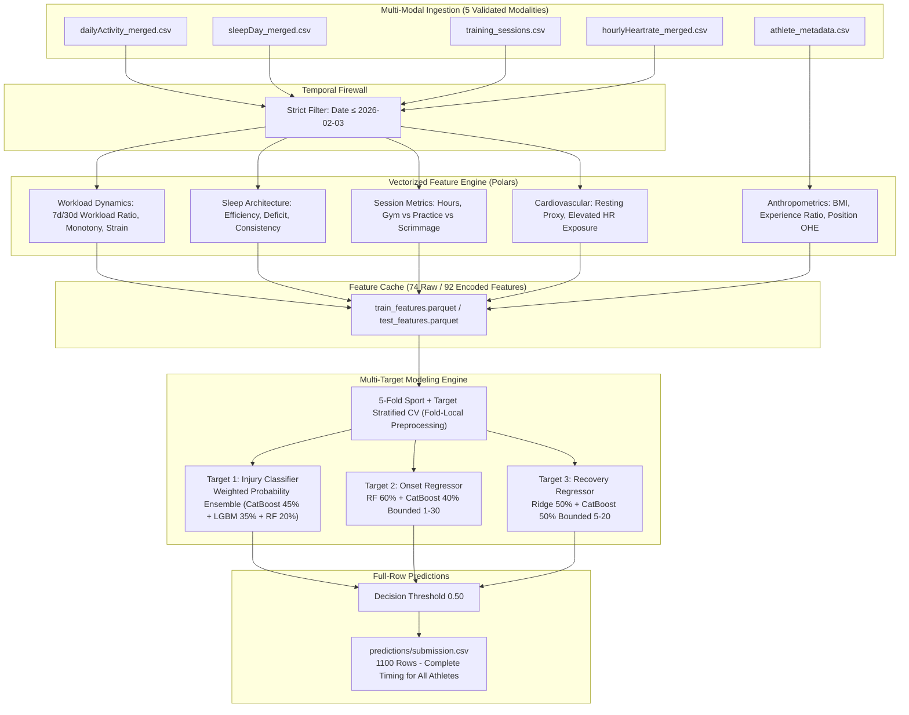

# Multimodal Athlete Injury Prediction System

[]()
[]()
[]()

Production-grade machine learning system designed to predict future athlete injury risk, onset timing, and recovery duration from multimodal wearable telemetry and training time-series data according to official PlayHack competition rules.

---

## 1. Executive Summary & Problem Formulation

The competition provides historical athlete tracking data across multiple sports and positions to forecast three distinct targets over a future **30-day risk window**:

1. **`injured_in_risk_window`**: Binary classification ($1 = \text{injured}$, $0 = \text{not injured}$).
2. **`onset_day_offset`**: Timing of injury onset ($1 \le \text{day} \le 30$) provided for all athletes.
3. **`recovery_duration`**: Duration of expected recovery ($5 \le \text{days} \le 20$) provided for all athletes.

### Official PlayHack Evaluation Mechanics:
- **Task A:** Evaluated using **$F_1$-score** on `injured_in_risk_window`.
- **Task B:** Evaluated for actually injured athletes using `onset_day_offset` and `recovery_duration`.
- **Skill Score Formulation:** $\text{Skill} = \max(0, 1 - \frac{\text{MAE}_{\text{model}}}{\text{MAE}_{\text{baseline}}})$, where the baseline predicts the training-set mean timing.
- **Missed-Injury Penalty:** If an actually injured athlete is missed by the classifier ($\text{Actual}=1, \text{Predicted}=0$), a fixed penalty of $n_{\text{risk}} = 30$ days applies to **both** timing predictions ($30 + 30 = 60$ days total error per false negative).
- **Submission Requirement:** The official PS requires `onset_day_offset` and `recovery_duration` for **every athlete** (all 1,100 test rows).

### Temporal Horizon & Strict Firewall:
- **Historical Observation Window (Both Train & Test):** `2026-01-05` to `2026-02-03` (30 days).
- **Risk Window (Train Only in Raw Data):** `2026-02-04` to `2026-03-05` (30 days).
- **Strict Temporal Firewall:** All feature extraction strictly filters `Date <= 2026-02-03 23:59:59` to prevent future/temporal data leakage.

---

## 2. System Architecture & Modality Ingestion



---

## 3. Validated Out-of-Fold Cross-Validation Performance

Evaluated across **5-Fold Sport + Target Stratified Cross-Validation with Strict Fold-Local Preprocessing** (zero data leakage between folds in median imputation and standard scaling):

### Task A: Injury Risk Classification ($N=3,000$, 35% Positive Injury Prevalence)
| Metric | Overall OOF Score | Fold Mean $\pm$ Std | Description |
| :--- | :---: | :---: | :--- |
| **ROC-AUC** | **0.7624** | **$0.7627 \pm 0.0170$** | Area under the ROC curve across all 5 folds |
| **PR-AUC** | **0.7570** | **$0.7570 \pm 0.0195$** | Precision-Recall AUC under 35% positive prevalence |
| **F1-Score** | **0.6621** | **$0.6616 \pm 0.0251$** | Peak $F_1$ at threshold $0.50$ (Precision: **$97.23\%$**, Recall: **$50.19\%$**) |
| **Brier Score** | **0.1453** | **$0.1454 \pm 0.0076$** | Mean squared probability error (well-calibrated raw ensemble) |
| **Accuracy** | **0.8207** | **$0.8207 \pm 0.0125$** | Overall binary classification accuracy |

### Task B: Timing Evaluation (Unpenalized Actually Injured vs. Official Penalized)

1. **Unpenalized Timing Performance (Among Actually Injured Athletes $N=1,050$):**
   - **Onset MAE:** **$2.6448$ days** (Training-Mean Baseline MAE: $7.6148$d $\to$ **Skill Score: $+0.6527$**)
   - **Recovery MAE:** **$2.9629$ days** (Training-Mean Baseline MAE: $3.2416$d $\to$ **Skill Score: $+0.0860$**)

2. **Official Penalized Timing Performance (All $N=1,050$ Actually Injured Athletes with $n_{\text{risk}}=30$ Penalty on 523 Misses):**
   - **Penalized Onset MAE:** **$15.31$ days** (Onset Skill vs. 30d trivial penalty baseline: **$+0.4898$**)
   - **Penalized Recovery MAE:** **$16.42$ days** (Recovery Skill vs. 30d trivial penalty baseline: **$+0.4526$**)
   - *Note:* Because the official PS does not provide a composite aggregation formula weighting Task A and Task B, threshold $0.50$ is retained because it maximizes the explicit Task A $F_1$-score.

---

## 4. Key Sports Science & Feature Engineering Insights

1. **Workload Spike Dynamics (`steps_acwr_7_30`):**
   - Defined as: $\text{steps\_mean\_7d} / (\text{steps\_mean\_30d} + 10^{-5})$ (acute 7-day load relative to chronic 30-day baseline).
   - Acute workload spikes ($>1.30$) provide strong predictive signal for injury risk ($r = +0.548$) and are strongly associated with earlier onset timing ($r = -0.863$).
2. **Sleep Architecture & Deficit (`sleep_deficit_mean_7d`, `sleep_eff_mean_30d`):**
   - Cumulative acute sleep debt ($\max(0, 480 - \text{sleep minutes})$) exhibits a meaningful association with increased injury vulnerability.
3. **Cardiovascular Stress Exposure (`hr_pct_elevated_120`, `hr_p10_resting_proxy`):**
   - Elevated heart rates ($\ge 120 \text{ bpm}$) outside scheduled sessions are informative markers of fatigue.

---

## 5. Directory Structure & Exact Feature Counts

- **Raw Multi-Modal Features (Parquet Matrix):** **74 features** (+ 5 ID/target columns = 79 columns).
- **Model Input Features (After One-Hot Encoding):** **92 features**.

```
├── configs/
│   └── config.yaml                     # Global parameters, paths, thresholds
├── data/
│   └── processed/
│       ├── train_features.parquet      # Pre-computed train matrix (3000 x 79)
│       └── test_features.parquet       # Pre-computed test matrix (1100 x 76)
├── models/
│   ├── multi_target_injury_system.joblib  # Production multi-target weighted ensemble
│   ├── preprocessor.joblib             # Fitted fold-safe median imputer and scaler
│   ├── feature_columns.json            # Exact 92 encoded feature definitions
│   └── metadata.json                   # Serialization and validation metadata
├── outputs/
│   ├── audit/                          # Dataset inventory, drift reports, leakage audit
│   ├── figures/                        # Publication-ready EDA and diagnostic plots
│   ├── features/
│   │   └── feature_dictionary.csv      # Complete 74-feature documentation dictionary
│   ├── experiments.csv                 # Detailed experiment tracking logs
│   └── metrics/
│       ├── final_validation_metrics.json
│       ├── oof_predictions.parquet     # Out-of-fold ground truth and prediction matrix
│       └── sport_error_breakdown.csv
├── predictions/
│   └── submission.csv                  # Validated submission file (1100 rows)
├── src/
│   ├── __init__.py
│   ├── data_loader.py                  # Temporal firewall data ingestion
│   ├── features.py                     # High-speed Polars multi-modal feature engine
│   ├── preprocessing.py                # Median imputation, OHE, scaling, column alignment
│   ├── validation.py                   # 5-Fold Sport+Target Stratified CV
│   ├── models.py                       # MultiTargetInjurySystem weighted ensembles
│   ├── train.py                        # Full fold-local CV benchmark, retraining, persistence
│   ├── predict.py                      # Test inference & submission generation
│   ├── evaluate.py                     # Comprehensive metric and error breakdown suite
│   ├── evaluate_playhack.py            # Official PlayHack scoring implementation
│   └── validate_submission.py          # Automated schema and invariant verification
├── Athlete_Injury_Prediction_Competition.pptx # 12-slide competition presentation deck
├── requirements.txt                    # Pinned production dependencies
└── README.md                           # Master project documentation
```

---

## 6. Exact Reproduction Commands

With the provided processed feature artifacts in `data/processed/`, model training, inference, and validation are fully reproducible:

```bash
# 1. Install dependencies
pip install -r requirements.txt

# 2. Train multi-target models with 5-Fold Cross Validation
python src/train.py

# 3. Generate test predictions across all 1,100 athletes
python src/predict.py

# 4. Run automated submission validator
python src/validate_submission.py
```

*Note: Raw source datasets must be supplied separately under `data_raw/` if regenerating feature matrices from scratch via `python -c "from src.features import FeatureEngineer; fe = FeatureEngineer(); fe.build_feature_matrices()"`, as raw multi-gigabyte files are excluded by `.gitignore`.*

---

## 7. Submission Invariants & Quality Assurance

The generated submission in `predictions/submission.csv` passes all competition invariants:
- **Exact Row Count:** 1,100 rows (Test athlete IDs $3001$ to $4100$).
- **Zero Nulls:** No NaN or missing values.
- **Integer Types:** `int64` across all columns.
- **Predicted Distribution:** $255$ predicted injured ($23.2\%$), $845$ predicted non-injured ($76.8\%$).
- **Full-Row Timing Invariant:** Timing predictions exist for **all 1,100 rows** (`onset_day_offset` observed in $[1, 26]$, `recovery_duration` observed in $[9, 16]$) in strict accordance with the official PlayHack problem statement.
